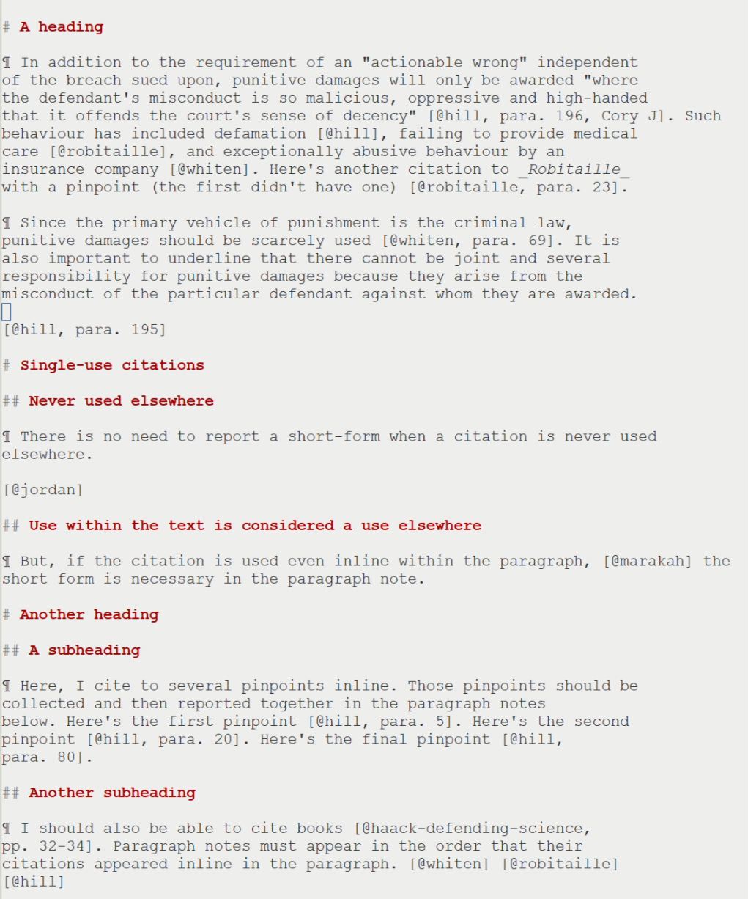
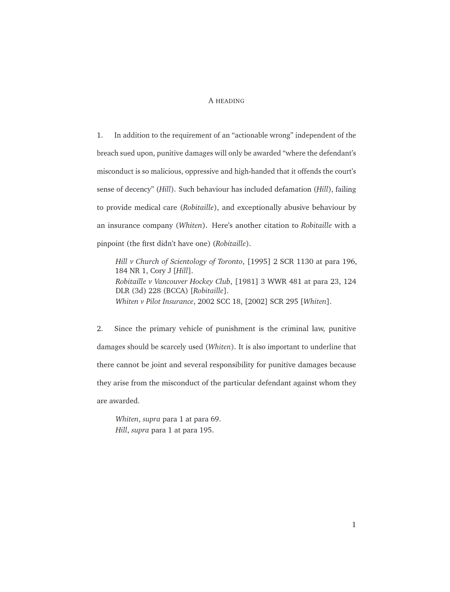

I want to write in as close to plain text as possible. I don't want to
think about formatting or citation layout while I'm writing. Those
things should be automatic. These are some tools that I'm trying to
use to get me there.

# Examples

Document source      |  Result
:-------------------------:|:-------------------------:
[](sample-factum-1.md)  |  [](sample-factum-1.pdf)

This system also generates a title page, table of contents, and table of authorities as required by the moot court.

# Technical details

Dependencies include: LaTex (texlive), Pandoc, Python 3, probably
more.

This is a work in progress. I'll be adding citation types as I need
them. Right now, it just barely works for legal cases and books. My
python pre-processor for per-paragraph notes is a quick hack. I want
that to be a proper Pandoc filter and I want to re-write it in Haskell
or Racket.

# For in-text citations

Like in the example here: https://guides.library.ubc.ca/legalcitation/intext

`pandoc sample-intext.md --bibliography sample-bibliography-1.yaml --csl allard-factum.csl -t plain`

or

`pandoc sample-intext.md --bibliography sample-bibliography-1.yaml --csl allard-factum.csl -o sample-intext.pdf`

# For factum style

These tools try to replicate the formating from the guidance and examples here:

- http://www.allard.ubc.ca/sites/www.allard.ubc.ca/files/uploads/first%20year/factum_citation_guide.pdf
- http://www.allard.ubc.ca/sites/www.allard.ubc.ca/files/uploads/moots/sample_appellants_factum_0.pdf

This is more complicated and can't be handled with Pandoc and CSL
alone (LaTeX/Bibtex doesn't do this either). So, I need to do some
custom pre-processing. I use CSL to generate the layout of a citation,
but my custom pre-processor puts that content into the appropriate
place for Pandoc. (This should really be done by a transformation
langauge that has a proper parser, tokenizer, etc.)

When writing markdown for this style, you need to use paragraph
markings (¶, or ◊). This is the only way the pre-processor can know where to
insert the per-paragraph notes. "Paragraphs" don't necessarily end
when there's a double linebreak. You may be making a quotation or some
text from a statute, but that isn't the end of the "paragraph" for the
purposes of the factum's structure or for inserting citations.

```
  ./paranotes-filter.py sample-factum-1.md sample-bibliography-1.yaml allard-factum.csl \
  | pandoc --bibliography sample-bibliography-1.yaml --csl allard-factum.csl --template=factum.latex -o sample-factum-1.pdf
```

Or, with a table-of-contents:

```
  ./paranotes-filter.py sample-factum-2.md sample-bibliography-2.yaml allard-factum.csl \
  | pandoc --bibliography sample-bibliography-2.yaml --csl allard-factum.csl --template=factum.latex --toc -o sample-factum-2.pdf
```
